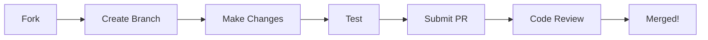

<h1 align="center">
  <br>
  <!-- Replace URL with actual logo -->
  
  <br>
  AkaneBot Projects
  <br>
</h1>

<h4 align="center">🤖 Unifying Communications Across WhatsApp, Discord, and Telegram 🚀</h4>

<p align="center">
  <a href="https://whatsapp.com/channel/0029Vaj5VRAFHWpy0YCWGe0U">
    
  </a>
  <a href="https://github.com/AkaneBot-Projects/AkaneBot/stargazers">
    
  </a>
  <a href="https://saweria.co/Arifzyn">
    
  </a>
  <a href="https://github.com/AkaneBot-Projects/akane-bot/issues">
    
  </a>
</p>

<p align="center">
  <a href="#✨-platform-features">Features</a> •
  <a href="#🛠️-technologies">Technologies</a> •
  <a href="#📦-projects">Projects</a> •
  <a href="#🤝-contributing">Contributing</a>
</p>

---

### ✨ Platform Features

<table>
  <tr>
    <td width="33%">
      <h3 align="center">📱 WhatsApp</h3>
      <ul>
        <li>Built with Baileys</li>
        <li>Group Management</li>
        <li>Auto-response System</li>
        <li>Sticker Creation</li>
        <li>Media Downloads</li>
      </ul>
    </td>
    <td width="33%">
      <h3 align="center">🎮 Discord</h3>
      <ul>
        <li>Powered by Discord.js</li>
        <li>Server Moderation</li>
        <li>Custom Commands</li>
        <li>Role Management</li>
        <li>Music Features</li>
      </ul>
    </td>
    <td width="33%">
      <h3 align="center">📬 Telegram</h3>
      <ul>
        <li>Using Telegraf</li>
        <li>Channel Management</li>
        <li>Inline Queries</li>
        <li>Bot Commands</li>
        <li>Media Handling</li>
      </ul>
    </td>
  </tr>
</table>

### 🎯 Core Features

```typescript
const AkaneBotFeatures = {
  whatsapp: {
    framework: "Baileys",
    features: ["Group Management", "Sticker Maker", "Auto-Reply"]
  },
  discord: {
    framework: "Discord.js",
    features: ["Server Moderation", "Custom Commands", "Music"]
  },
  telegram: {
    framework: "Telegraf",
    features: ["Channel Management", "Inline Queries", "Media Handler"]
  }
};
```

### 🛠️ Technologies

<p align="center">
  <table align="center">
    <tr>
      <td align="center"><strong>Core</strong></td>
      <td align="center"><strong>Frameworks</strong></td>
      <td align="center"><strong>Database</strong></td>
      <td align="center"><strong>Tools</strong></td>
    </tr>
    <tr>
      <td align="center">
        Node.js<br>TypeScript<br>Express.js
      </td>
      <td align="center">
        Baileys<br>Discord.js<br>Telegraf
      </td>
      <td align="center">
        MongoDB<br>Redis
      </td>
      <td align="center">
        Docker<br>Git<br>PM2
      </td>
    </tr>
  </table>
</p>

### 📦 Projects

<table>
  <tr>
    <td>
      <h3>📱 AkaneBot-WA</h3>
      <p>Advanced WhatsApp bot using Baileys with extensive features.</p>
      <a href="https://github.com/AkaneBot-Projects/akane-bot">Learn More →</a>
    </td>
    <td>
      <h3>🎮 AkaneBot-DC</h3>
      <p>Feature-rich Discord bot powered by Discord.js.</p>
      <a href="https://github.com/AkaneBot-Projects/Akane-bot-discord">Learn More →</a>
    </td>
  </tr>
  <tr>
    <td>
      <h3>📬 AkaneBot-TG</h3>
      <p>Powerful Telegram bot built with Telegraf.</p>
      <a href="https://github.com/AkaneBot-Projects/akane-bot-tg">Learn More →</a>
    </td>
    <td>
      <h3>🌐 AkaneAPI</h3>
      <p>Unified API for all platform integrations.</p>
      <a href="https://github.com/AkaneBot-Projects/AkaneAPI">Learn More →</a>
    </td>
  </tr>
</table>

### 🤝 Contributing

We love our contributors! Here's how you can help:



### 📞 Connect With Us

<p align="center">
  <table align="center">
    <tr>
      <td align="center">
        <strong>WhatsApp Channel</strong><br>
        <a href="https://whatsapp.com/channel/0029Vaj5VRAFHWpy0YCWGe0U">Join Now</a>
      </td>
      <td align="center">
        <strong>Support Us</strong><br>
        <a href="https://saweria.co/Arifzyn">Saweria</a>
      </td>
      <td align="center">
        <strong>Email</strong><br>
        support@akanebot.xyz
      </td>
    </tr>
  </table>
</p>

---

<p align="center">
  <sub>Built with ❤️ by the AkaneBot Team</sub>
</p>

<p align="center">
  <a href="https://github.com/AkaneBot-Projects/.github/blob/main/LICENSE">
    
  </a>
</p>
